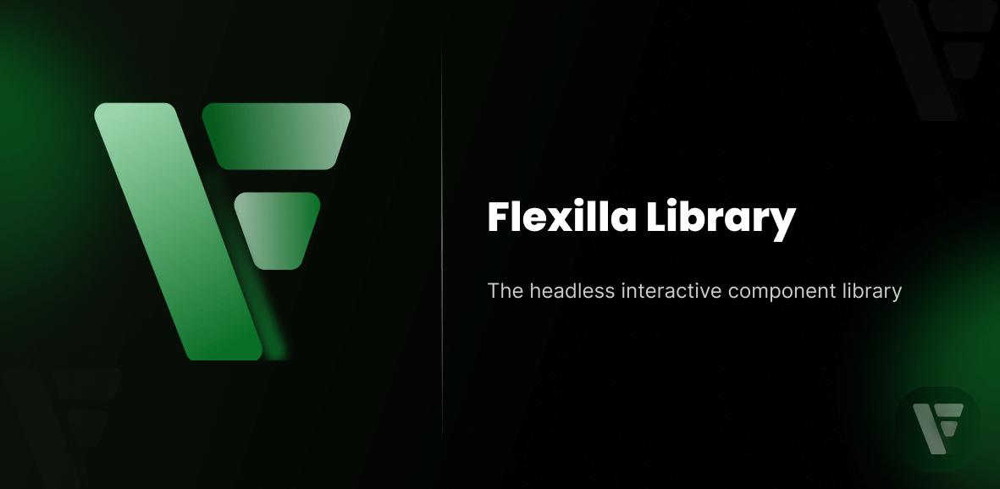

<p align="center">
<a href="https://github.com/unify-ui-dev/flexilla" target="_blank">

</a>
</p>

# Flexilla

Flexilla is an open-source set of unstyled interactive UI components for building interactive and customizable user interfaces.

## Why Flexilla

Flexilla is a set of unstyled components  that help you quickly add interactivity to your UI Element with accessibility in mind. Flexilla includes Dropdown, collapse, accordion, tabs, Offcanvas and more.

## Installation

1. Install all components

To install the library :

- Install It From Npm
   
You need to add it as a dependency in your project using npm or any other package manager

```bash
npm install @flexilla/flexilla
```
Or
```bash
yarn add @flexilla/flexilla
```

- Use CDN

You need to include the following script in your project 

```html
<head>
    <!-- other meta tags -->
    <script src="https://unpkg.com/@flexilla/flexilla@latest/dist/flexilla.min.js"></script>
</head>
<body>

    <script>
        const accordion = new Flexilla.Accordion("#myAccordion");
        const tabs = new Flexilla.Tabs("#my-tabs");
    </script>
</body>
```

Import Module from CDN

```html
<script type="module">
  import { Accordion, Tabs } from 'https://cdn.jsdelivr.net/npm/@flexilla/flexilla@latest/dist/flexilla.esm.min.js';

  const accordion = new Accordion("#selector");
</script>
```

> **Note** : You can use any available CDN Deliver

1. Install a single package

If you want to use only one package or two then we recommand you to install only those packages

- let's say you need an Accordion component only

```shell
npm install @flexilla/accordion
```

[Check all packages](./packages/)

## Usage

See examples [Here](./examples/vanilla/)

## Contributing

To contribute to this project, please make sure you read our [contributing guide](CONTRIBUTING.MD) before submitting a pull request.

## 🙌 Acknowledgement

Flexilla is made possible thanks to the inspirations from the following projects:

- <a href="https://github.com/htmlstreamofficial/preline" target="_blank">Preline Plugins</a>
- <a href="https://github.com/themesberg/flowbite" target="_blank">Flowbite Plugin</a>

## 📄 License

This project is licensed under the **MIT License** - see the [**MIT License**](LICENSE) file for details.